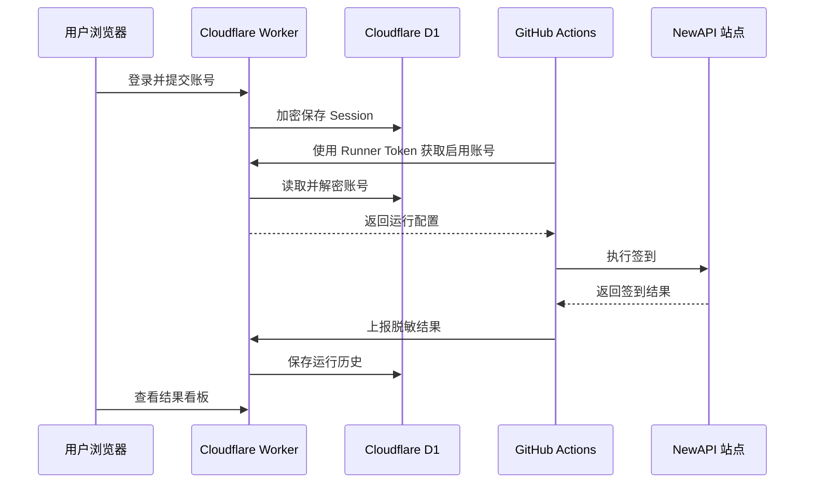

# 首次使用：从部署完成到第一次自动签到

这份指南从 Worker 部署成功开始，带你完成账号录入、GitHub Actions 连接和第一次签到验收。Cloudflare 和 GitHub 的完整部署步骤见 [WORKER_DEPLOYMENT.md](WORKER_DEPLOYMENT.md)。

所有网页操作都在 Worker 根地址完成。GitHub Pages 和根目录静态页面不参与签到链路。

## 完成标准

完成本指南后应满足以下条件：

- `/api/health` 返回 `database: connected`。
- Worker 控制台中至少有一个启用账号。
- GitHub Actions 可以获取账号并完成签到。
- Worker 控制台显示本次运行和账号级结果。
- 定时工作流保持启用状态。

## 完成后的数据链路



## 开始前检查

访问：

```text
https://你的-worker地址/api/health
```

配置完整时返回：

```json
{
  "ok": true,
  "service": "newapi-checkin-worker",
  "database": "connected",
  "time": "..."
}
```

返回 HTTP 503 时，根据 `missing` 数组补齐 Cloudflare Worker Binding 或 Secret。

## 第一步：登录 Worker 控制台

1. 浏览器打开 Worker 根地址，例如 `https://newapi-checkin.example.workers.dev`。
2. 输入 Cloudflare Worker 中设置的 `DASHBOARD_PASSWORD`。
3. 点击“验证并进入”。

这里使用的是浏览器控制台口令。该口令与 GitHub Actions 使用的 `RUNNER_TOKEN` 是两套独立凭据。

## 第二步：获取 NewAPI 账号信息

### 1. 站点地址

填写登录 NewAPI 时使用的根地址：

```text
https://api.example.com
```

以下地址应整理成根地址再填写：

```text
浏览器当前页面：https://api.example.com/console/personal
应填写：https://api.example.com
```

### 2. Session Cookie

以 Chrome 或 Edge 为例：

1. 在目标 NewAPI 站点完成登录。
2. 按 `F12` 打开开发者工具。
3. 打开 `Application`，中文界面通常显示为“应用”。
4. 在左侧打开 `Storage` -> `Cookies`。
5. 点击当前 NewAPI 站点域名。
6. 在表格中找到名称为 `session` 的 Cookie。
7. 复制 `Value` 列的完整内容。

表单只需要 Value：

```text
浏览器 Cookie：session=abc123xyz; Path=/; HttpOnly
表单填写：abc123xyz
```

表单只填写 Value，省略 `session=` 前缀和末尾分号。

### 3. 用户 ID

必须填写。Session Cookie 本身不能可靠推导用户 ID，签到接口通常要求请求头：

```text
new-api-user: 12345
```

获取方式：登录目标站点，打开浏览器开发者工具的 Network，筛选 Fetch/XHR，选择任一已登录 API 请求，在 Request Headers 中复制 `new-api-user` 的值。

### 4. cf_clearance

通常留空。项目检测到 Cloudflare 拦截后会尝试 Playwright 回退。

需要手动填写时，在浏览器 Cookies 列表找到 `cf_clearance`，复制 Value 列内容。该 Cookie 可能绑定浏览器环境并会过期，因此只作为辅助配置。

## 第三步：在 Worker 控制台添加账号

表单字段对应关系：

| 字段 | 必填 | 示例 | 说明 |
|------|------|------|------|
| 备注名称 | 是 | `主力站` | 只用于识别账号 |
| 用户 ID | 是 | `12345` | 浏览器请求头 `new-api-user` 的值 |
| 站点地址 | 是 | `https://api.example.com` | 填根地址 |
| Session Cookie | 是 | `abc123xyz` | 只填 session 的 Value |
| cf_clearance | 否 | `clearance-value` | Cloudflare 站点辅助 Cookie |

点击“加密保存账号”后：

1. 浏览器通过 HTTPS 将表单提交到 Worker。
2. Worker 使用 `DATA_ENCRYPTION_KEY` 派生 AES 密钥。
3. Worker 将 URL、Session、用户 ID 和 cf_clearance 加密。
4. 密文写入 `Check` Binding 对应的 D1 数据库。
5. 控制台只显示站点 Origin 和状态，不会重新返回 Session。

账号出现在“账号健康状态”且状态为“等待首跑”，表示保存成功。

Session 过期时，在账号行点击“更新凭据”，重新复制并填写新的 Session。Worker 会覆盖该账号的加密运行配置，并保留账号本身和历史运行记录。

## 第四步：连接 Worker 与 GitHub Actions

需要建立两个对应关系。

### Worker 地址

复制浏览器地址栏中的 Worker 根地址：

```text
https://newapi-checkin.example.workers.dev
```

在 GitHub 仓库打开：

```text
Settings -> Secrets and variables -> Actions -> New repository secret
```

创建：

```text
Name: CHECKIN_WORKER_URL
Secret: https://newapi-checkin.example.workers.dev
```

该 Secret 使用 Worker 根地址，省略 `/api` 路径和末尾 `/`。

### Runner Token

Cloudflare Worker 中已经有一个由你生成的 Secret：

```text
RUNNER_TOKEN=<随机值>
```

在 GitHub Actions Secrets 创建：

```text
Name: CHECKIN_RUNNER_TOKEN
Secret: <与 Cloudflare RUNNER_TOKEN 完全相同的随机值>
```

名称不同，值相同：

```text
Cloudflare Worker RUNNER_TOKEN
                =
GitHub Actions CHECKIN_RUNNER_TOKEN
```

GitHub 无法读取已经保存的 Secret 原值。如果忘记了 `RUNNER_TOKEN`，生成一个新值，并同时更新 Cloudflare 与 GitHub。

## 第五步：手动执行第一次签到

1. 打开 GitHub 仓库的 `Actions` 页面。
2. 在左侧选择 `NewAPI 自动签到`。
3. 点击 `Run workflow`。
4. 分支选择 `main`。
5. 再次点击绿色的 `Run workflow` 按钮。
6. 等待新运行记录出现并打开日志。

正常日志顺序：

```text
[Worker] 正在获取启用账号配置...
[Worker] 成功获取 1 个账号配置
共 1 个账号待签到
签到完成: 成功 1, 失败 0
[Worker] 签到结果上报成功
```

## 第六步：确认完整链路成功

回到 Worker 控制台并刷新页面，检查：

- “最近成功”大于 0。
- “成功率”有数值。
- 账号状态从“等待首跑”变成“运行正常”或“签到失败”。
- “运行历史”出现刚才的执行时间。
- 点击运行记录可以查看账号级结果。

以上五项出现后，GitHub Actions 会每天北京时间约 08:10 尝试执行一次。GitHub schedule 可能出现平台级延迟。

## 常见首次配置错误

### Runner 未授权

原因：GitHub `CHECKIN_RUNNER_TOKEN` 与 Cloudflare `RUNNER_TOKEN` 值不一致。

处理：生成一个新 Token，同时更新两边。

### 成功获取 0 个账号

原因：控制台中没有账号，或账号已停用。

处理：添加账号并将账号状态设置为“已启用”。

Actions 日志也会直接显示：

```text
[Worker] 没有启用的签到账号，请先在 Worker 控制台添加或启用账号
```

### Session 可能已过期

原因：复制错误、包含了 `session=`、Session 已失效。

处理：重新登录 NewAPI，重新复制 `session` Cookie 的 Value，在控制台账号行点击“更新凭据”并提交。

### 获取用户信息失败

处理顺序：

1. 检查 Session。
2. 在 `/api/user/self` 响应中找到 `data.id`。
3. 重新添加账号并填写用户 ID。

### Worker 提示 Check 未定义 / reading 'prepare'

原因：Cloudflare 自动资源配置尚未完成，或当前部署没有名称为 `Check` 的 D1 Binding。

处理：

1. 打开 Worker → Settings → Bindings，确认存在自动创建的 `Check` D1 Binding。
2. 在 Deployments 中重新运行最新的 Git 部署，让 Cloudflare 完成自动资源配置。
3. 打开 `/api/health`，确认返回 `database: connected` 且 `missing` 不含 `Check`。

已有 Worker 在部署前已经绑定 `Check` 时，Wrangler 会继续使用该 Binding 指向的原数据库，不会替换已有账号和历史数据。
