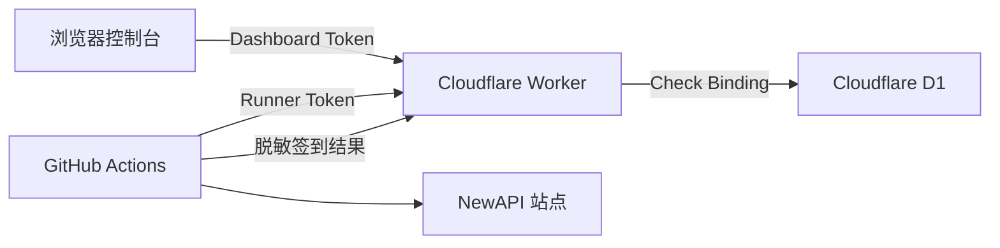

# Check Console

> NewAPI 多账号自动签到控制台。配置与结果由 Cloudflare Worker 承载，数据保存在 D1，GitHub Actions 专注执行签到。

项目采用 Worker-only Web 架构。生产控制台只由 `worker/public/index.html` 提供，无需启用 GitHub Pages。

[首次使用指南](FIRST_RUN.md) · [部署指南](WORKER_DEPLOYMENT.md) · [Worker 源码](worker/src/index.js) · [控制台 UI](worker/public/index.html) · [MIT License](LICENSE)

## 项目定位

Check Console 把分散在 GitHub Secrets、Actions 日志和本地配置中的信息收拢到一个 Worker 控制台：

| 能力 | 实现 |
|------|------|
| 账号配置 | Worker 同源控制台 |
| 认证信息存储 | AES-256-GCM 加密后写入 D1 |
| 定时执行 | GitHub Actions |
| 结果查询 | Worker API + D1 历史记录 |
| 访问控制 | 浏览器 Session Token + Runner Token |
| Cloudflare 站点 | Playwright 回退流程 |

## 系统架构



Worker 根地址同时提供控制台和 API。D1 数据库名称可以自定义，Binding 变量名固定为区分大小写的 `Check`。

## 凭据说明

以下三个值均由部署者自行生成，且应使用互不相同的值：

| Worker 变量 | 建议 | 作用 |
|-------------|------|------|
| `DASHBOARD_PASSWORD` | 密码管理器生成 20 位以上口令 | 登录浏览器控制台 |
| `RUNNER_TOKEN` | 32 字节随机值 | GitHub Actions 调用 Worker |
| `DATA_ENCRYPTION_KEY` | 32 字节随机值 | 加密账号 Session |

可通过 OpenSSL 生成：

```bash
# 控制台登录口令
openssl rand -base64 24

# Runner Token
openssl rand -hex 32

# 数据加密密钥
openssl rand -hex 32
```

请分别执行并保存三个结果。`RUNNER_TOKEN` 还需要以 `CHECKIN_RUNNER_TOKEN` 的名字保存到 GitHub Actions Secrets。

## 登录有效期

`SESSION_TTL_SECONDS=86400` 表示浏览器控制台登录状态有效 24 小时。

该变量只控制 Dashboard Token：

- 浏览器超过 24 小时后需要重新输入 `DASHBOARD_PASSWORD`。
- GitHub Actions 使用独立的 `RUNNER_TOKEN`。
- 每日自动签到不读取 Dashboard Token。
- 控制台登录过期不会中断定时签到。

个人部署推荐保留 `86400`。更严格的环境可使用 `3600`，受信任的私人环境可使用 `604800`。

## 五步部署

完整操作与排障过程见 [Cloudflare Worker 完整部署指南](WORKER_DEPLOYMENT.md)。

### 1. 创建并初始化 D1

```bash
cd worker
wrangler d1 create newapi-checkin
wrangler d1 execute newapi-checkin --remote --file=./schema.sql
```

### 2. 连接 GitHub 仓库

在 Cloudflare Workers Builds 中使用以下设置：

| 设置 | 值 |
|------|----|
| Repository | `zhikanyeye/Newapi-checkin` |
| Production branch | `main` |
| Root directory | `worker` |
| Build command | 留空 |
| Deploy command | `npm run deploy` |

### 3. 配置 Worker Bindings

在 Worker 设置中添加：

| 类型 | 名称 | 值 |
|------|------|----|
| D1 Binding | `Check` | 选择已创建的数据库 |
| Secret | `DASHBOARD_PASSWORD` | 自行生成 |
| Secret | `RUNNER_TOKEN` | 自行生成 |
| Secret | `DATA_ENCRYPTION_KEY` | 自行生成 |
| Variable | `SESSION_TTL_SECONDS` | `86400` |

### 4. 配置 GitHub Actions

在 GitHub `Settings` -> `Secrets and variables` -> `Actions` 添加：

| Secret | 值 |
|--------|----|
| `CHECKIN_WORKER_URL` | Worker 根地址 |
| `CHECKIN_RUNNER_TOKEN` | 与 Worker `RUNNER_TOKEN` 完全一致 |

### 5. 完成首次联调

1. 打开 Worker 根地址，用 `DASHBOARD_PASSWORD` 登录。
2. 从 NewAPI 站点浏览器 Cookies 中复制 `session` 的 Value。
3. 在控制台填写备注名称、站点根地址、Session 和浏览器请求头中的 `new-api-user`；`cf_clearance` 为可选项。
4. 将 Worker 地址保存为 GitHub Secret `CHECKIN_WORKER_URL`。
5. 将 Cloudflare `RUNNER_TOKEN` 的同一个值保存为 GitHub Secret `CHECKIN_RUNNER_TOKEN`。
6. 在 GitHub Actions 中手动运行 `NewAPI 自动签到`。
7. 刷新控制台，确认账号状态和运行历史已经更新。

账号字段获取方式、Secrets 的逐项填写位置和完整请求链路见 [首次使用指南](FIRST_RUN.md)。

## 数据安全

- Session 与 `cf_clearance` 在写入 D1 前使用 AES-GCM 加密。
- `DATA_ENCRYPTION_KEY` 经 SHA-256 派生为 AES-256 密钥。
- 每条账号配置使用独立随机 IV。
- Dashboard Token 在 D1 中只保存 SHA-256 哈希。
- Dashboard API 只返回账号名称、站点 Origin 和状态信息。
- Runner API 通过独立 `RUNNER_TOKEN` 保护。
- `.env` 与 `worker/.dev.vars` 已加入 `.gitignore`。

## 项目结构

```text
.
├── .github/workflows/checkin.yml  # 每天执行一次签到 Runner
├── checkin.py                     # 签到、配置拉取和结果上报
├── cf_bypass.py                   # Cloudflare 检测与回退
├── dingtalk_notifier.py           # 可选钉钉通知
├── FIRST_RUN.md                   # 首次账号录入与 Actions 联调
├── WORKER_DEPLOYMENT.md           # 完整部署与排障指南
└── worker/
    ├── public/index.html          # 生产控制台 UI
    ├── src/index.js               # Worker API
    ├── schema.sql                 # D1 数据结构
    ├── package.json               # Workers Builds 命令
    ├── wrangler.toml              # Worker 与 Static Assets 配置
    └── .dev.vars.example          # 本地变量模板
```

## API 概览

| 方法 | 路径 | 鉴权 | 用途 |
|------|------|------|------|
| `GET` | `/api/health` | 无 | 检查 Worker 服务 |
| `POST` | `/api/auth/login` | 控制台口令 | 获取浏览器 Session Token |
| `GET` | `/api/dashboard/summary` | Dashboard Token | 摘要与账号状态 |
| `GET` | `/api/dashboard/runs` | Dashboard Token | 最近 30 次运行 |
| `GET` | `/api/dashboard/runs/:id` | Dashboard Token | 单次运行明细 |
| `POST` | `/api/dashboard/accounts` | Dashboard Token | 添加加密账号 |
| `PATCH` | `/api/dashboard/accounts/:id` | Dashboard Token | 更新凭据、启用或停用账号 |
| `GET` | `/api/runner/config` | Runner Token | 获取启用账号 |
| `POST` | `/api/runner/report` | Runner Token | 上报脱敏结果 |

## 本地开发

```bash
cd worker
cp .dev.vars.example .dev.vars
npm install
npm run db:init:local
npm run dev
```

另开终端运行 Runner：

```bash
export CHECKIN_WORKER_URL=http://127.0.0.1:8787
export CHECKIN_RUNNER_TOKEN=与_dev_vars_中的_RUNNER_TOKEN_一致
python3 checkin.py
```

## 兼容能力

`checkin.py` 仍支持 `NEWAPI_ACCOUNTS` 和 `CONFIG_URL` 回退配置。新部署建议使用 Worker 作为唯一账号配置源。

## 致谢

项目基于 Jasonliu-0 发布的 MIT 开源项目改造，感谢原作者提供签到逻辑、配置工具和 GitHub Actions 基础实现。原始版权声明和 MIT License 保留在仓库中。

NewAPI 兼容接口来源于 [New API](https://github.com/Calcium-Ion/new-api)。

## License

[MIT License](LICENSE) · Maintained by [zhikanyeye](https://github.com/zhikanyeye)
