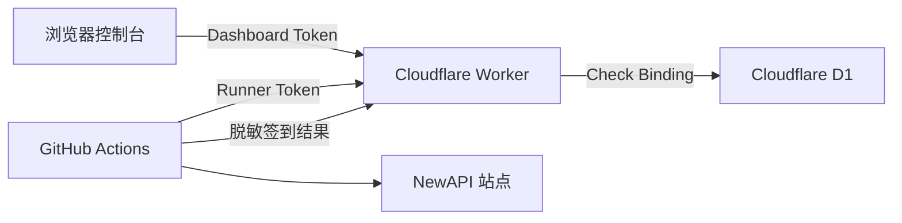

# Check Console

<div align="center">
  <strong>NewAPI 多账号自动签到、加密配置与结果看板</strong>
  <br>
  Cloudflare Worker + D1 + GitHub Actions
</div>

---

Check Console 将账号配置、定时签到和运行结果整合为一套轻量服务。Cloudflare Worker 提供管理控制台和 API，D1 保存加密账号与运行历史，GitHub Actions 每天执行签到任务。

生产控制台由 Worker Static Assets 托管，整个项目无需 GitHub Pages、独立服务器或仓库内数据库 ID。

**文档导航：** [快速部署](#快速部署) · [首次使用](FIRST_RUN.md) · [完整部署](WORKER_DEPLOYMENT.md) · [安全说明](SECURITY.md) · [开发文档](docs/INDEX.md)

## 核心能力

Check Console 把分散在 GitHub Secrets、Actions 日志和本地配置中的信息收拢到一个 Worker 控制台：

| 能力 | 说明 |
|------|------|
| 多账号管理 | 在 Worker 控制台添加、更新、启用和停用账号 |
| 加密存储 | Session、用户 ID 和可选 Cookie 经 AES-256-GCM 加密后写入 D1 |
| 每日签到 | GitHub Actions 每天北京时间约 08:10 自动执行，也支持手动触发 |
| 运行看板 | 展示最近结果、成功率、连续失败次数和最近 30 次运行 |
| 双重鉴权 | Dashboard Token 保护管理接口，Runner Token 保护执行器接口 |
| 兼容接口 | 优先调用 `/api/user/sign_in`，在端点不可用时回退 `/api/user/checkin` |
| 可选通知 | 支持钉钉机器人推送签到摘要 |

## 工作原理



Worker 根地址同时提供控制台和 API。Cloudflare 首次部署时自动创建 D1，Binding 变量名固定为区分大小写的 `Check`，数据库 ID 仅保存在 Cloudflare 账号中。

已有部署升级时，Wrangler 会按 Binding 类型和名称继承远端现有的 `Check` D1，因此账号与运行历史继续保存在原数据库。远端缺少 `Check` 时才会自动创建新数据库。

一次完整运行包含以下步骤：

1. GitHub Actions 使用 Runner Token 从 Worker 获取启用账号。
2. Runner 访问 NewAPI 用户信息与签到接口。
3. Runner 将脱敏结果上报 Worker。
4. Worker 更新 D1 中的运行历史与账号状态。
5. 浏览器通过 Dashboard Token 查询看板数据。

## 配置概览

### Cloudflare Worker

以下三个值均由部署者自行生成，并使用互不相同的随机值：

| Worker 变量 | 建议 | 作用 |
|-------------|------|------|
| `DASHBOARD_PASSWORD` | 密码管理器生成 20 位以上口令 | 登录浏览器控制台 |
| `RUNNER_TOKEN` | 32 字节随机值 | GitHub Actions 调用 Worker |
| `DATA_ENCRYPTION_KEY` | 32 字节随机值 | 加密账号 Session |

可使用 OpenSSL 生成：

```bash
# 控制台登录口令
openssl rand -base64 24

# Runner Token
openssl rand -hex 32

# 数据加密密钥
openssl rand -hex 32
```

`RUNNER_TOKEN` 还需要以 `CHECKIN_RUNNER_TOKEN` 的名称保存到 GitHub Actions Secrets。

### GitHub Actions

| Secret | 必填 | 用途 |
|--------|------|------|
| `CHECKIN_WORKER_URL` | 是 | Worker 根地址，不包含 `/api` 和末尾斜杠 |
| `CHECKIN_RUNNER_TOKEN` | 是 | 与 Cloudflare `RUNNER_TOKEN` 使用同一个值 |
| `DINGTALK_WEBHOOK` | 否 | 钉钉机器人 Webhook |
| `DINGTALK_SECRET` | 否 | 钉钉机器人加签密钥 |

### 登录有效期

`SESSION_TTL_SECONDS=86400` 表示浏览器控制台登录状态有效 24 小时。

该变量只控制 Dashboard Token：

- 浏览器超过 24 小时后需要重新输入 `DASHBOARD_PASSWORD`。
- GitHub Actions 使用独立的 `RUNNER_TOKEN`。
- 每日自动签到不读取 Dashboard Token。
- 控制台登录过期不会中断定时签到。

个人部署推荐保留 `86400`。更严格的环境可使用 `3600`，受信任的私人环境可使用 `604800`。

## 快速部署

完整界面路径、验证方法和排障步骤见 [Cloudflare Worker 完整部署指南](WORKER_DEPLOYMENT.md)。

### 1. 连接 GitHub 仓库

在 Cloudflare Workers Builds 中使用以下设置：

| 设置 | 值 |
|------|----|
| Repository | `zhikanyeye/Newapi-checkin` |
| Production branch | `main` |
| Root directory | `worker` |
| Build command | 留空 |
| Deploy command | `npm run deploy` |

Cloudflare 会根据仓库中的 `Check` Binding 自动创建并绑定 D1。Worker 首次收到请求时自动建表，仓库中无需数据库 ID。

### 2. 配置 Worker Bindings

首次部署完成后，在 Worker 设置中确认 `Check` D1 Binding 已自动生成，再添加运行时变量：

| 类型 | 名称 | 值 |
|------|------|----|
| Secret | `DASHBOARD_PASSWORD` | 自行生成 |
| Secret | `RUNNER_TOKEN` | 自行生成 |
| Secret | `DATA_ENCRYPTION_KEY` | 自行生成 |
| Variable | `SESSION_TTL_SECONDS` | `86400` |

### 3. 配置 GitHub Actions

在 GitHub `Settings` -> `Secrets and variables` -> `Actions` 添加：

| Secret | 值 |
|--------|----|
| `CHECKIN_WORKER_URL` | Worker 根地址 |
| `CHECKIN_RUNNER_TOKEN` | 与 Worker `RUNNER_TOKEN` 完全一致 |

### 4. 完成首次联调

1. 打开 Worker 根地址，用 `DASHBOARD_PASSWORD` 登录。
2. 从 NewAPI 站点浏览器 Cookies 中复制 `session` 的 Value。
3. 在控制台填写备注名称、站点根地址、Session 和浏览器请求头中的 `new-api-user`；`cf_clearance` 为可选项。
4. 将 Worker 地址保存为 GitHub Secret `CHECKIN_WORKER_URL`。
5. 将 Cloudflare `RUNNER_TOKEN` 的同一个值保存为 GitHub Secret `CHECKIN_RUNNER_TOKEN`。
6. 在 GitHub Actions 中手动运行 `NewAPI 自动签到`。
7. 刷新控制台，确认账号状态和运行历史已经更新。

账号字段获取方式、Secrets 的填写位置和验收标准见 [首次使用指南](FIRST_RUN.md)。

## 账号字段

| 字段 | 必填 | 填写内容 |
|------|------|----------|
| 备注名称 | 是 | 仅用于控制台识别账号 |
| 用户 ID | 是 | 浏览器 Network 请求头 `new-api-user` 的值 |
| 站点地址 | 是 | NewAPI 根地址，例如 `https://api.example.com` |
| Session Cookie | 是 | `session` Cookie 的 Value，不包含 `session=` 和分号 |
| `cf_clearance` | 否 | Cloudflare 挑战站点的辅助 Cookie，通常留空 |

## 安全设计

- Session 与 `cf_clearance` 在写入 D1 前使用 AES-GCM 加密。
- `DATA_ENCRYPTION_KEY` 经 SHA-256 派生为 AES-256 密钥。
- 每条账号配置使用独立随机 IV。
- Dashboard Token 在 D1 中只保存 SHA-256 哈希。
- Dashboard API 只返回账号名称、站点 Origin 和状态信息。
- Runner API 通过独立 `RUNNER_TOKEN` 保护。
- `.env` 与 `worker/.dev.vars` 已加入 `.gitignore`。

Session、Token 和 Cookie 属于敏感凭据。请在私有环境录入，避免将真实值写入仓库、Issue、聊天记录或 Actions 日志。完整边界与轮换建议见 [SECURITY.md](SECURITY.md)。

## 项目结构

```text
.
├── .github/workflows/checkin.yml  # 每天执行一次签到 Runner
├── checkin.py                     # 签到、配置拉取和结果上报
├── cf_bypass.py                   # Cloudflare 检测与回退
├── dingtalk_notifier.py           # 可选钉钉通知
├── FIRST_RUN.md                   # 首次账号录入与 Actions 联调
├── SECURITY.md                    # 凭据、存储和使用安全说明
├── WORKER_DEPLOYMENT.md           # 完整部署与排障指南
└── worker/
    ├── public/index.html          # 生产控制台 UI
    ├── src/index.js               # Worker API
    ├── schema.sql                 # D1 数据结构
    ├── package.json               # Workers Builds 命令
    ├── wrangler.toml              # Worker 与 Static Assets 配置
    └── .dev.vars.example          # 本地变量模板
```

## API 概览

| 方法 | 路径 | 鉴权 | 用途 |
|------|------|------|------|
| `GET` | `/api/health` | 无 | 检查 Worker 服务 |
| `POST` | `/api/auth/login` | 控制台口令 | 获取浏览器 Session Token |
| `GET` | `/api/dashboard/summary` | Dashboard Token | 摘要与账号状态 |
| `GET` | `/api/dashboard/runs` | Dashboard Token | 最近 30 次运行 |
| `GET` | `/api/dashboard/runs/:id` | Dashboard Token | 单次运行明细 |
| `POST` | `/api/dashboard/accounts` | Dashboard Token | 添加加密账号 |
| `PATCH` | `/api/dashboard/accounts/:id` | Dashboard Token | 更新凭据、启用或停用账号 |
| `GET` | `/api/runner/config` | Runner Token | 获取启用账号 |
| `POST` | `/api/runner/report` | Runner Token | 上报脱敏结果 |

## 本地开发

```bash
cd worker
cp .dev.vars.example .dev.vars
npm install
npm run db:init:local
npm run dev
```

另开终端运行 Runner：

```bash
export CHECKIN_WORKER_URL=http://127.0.0.1:8787
export CHECKIN_RUNNER_TOKEN=与_dev_vars_中的_RUNNER_TOKEN_一致
python3 checkin.py
```

本地 Worker 默认地址为 `http://127.0.0.1:8787`。`.dev.vars` 只用于本地开发，并已被 Git 忽略。

## 兼容模式

Runner 按以下优先级读取账号：Worker API、`CONFIG_URL`、`NEWAPI_ACCOUNTS`。新部署推荐使用 Worker 控制台，后两种方式用于兼容旧配置。

## 文档

| 文档 | 适用场景 |
|------|----------|
| [FIRST_RUN.md](FIRST_RUN.md) | Worker 部署完成后的账号录入与首次签到 |
| [WORKER_DEPLOYMENT.md](WORKER_DEPLOYMENT.md) | Cloudflare、D1、GitHub Actions 的完整部署和排障 |
| [SECURITY.md](SECURITY.md) | 凭据保护、数据加密、轮换和调试边界 |
| [docs/INDEX.md](docs/INDEX.md) | 架构、API 与开发者文档索引 |

## 已知限制

- GitHub Actions 的定时任务可能出现平台级延迟。
- `cf_clearance` 可能绑定浏览器环境、IP 和有效期，自动流程无法保证通过所有挑战。
- `DATA_ENCRYPTION_KEY` 丢失后，已有账号密文无法恢复，需要重新录入账号。
- NewAPI 衍生站点的接口响应可能存在差异，Runner 已覆盖常见格式和旧签到端点。

## 致谢

项目基于 Jasonliu-0 发布的 MIT 开源项目改造，感谢原作者提供签到逻辑、配置工具和 GitHub Actions 基础实现。原始版权声明和 MIT License 保留在仓库中。

NewAPI 兼容接口来源于 [New API](https://github.com/Calcium-Ion/new-api)。

## License

[MIT License](LICENSE) · Maintained by [zhikanyeye](https://github.com/zhikanyeye)
