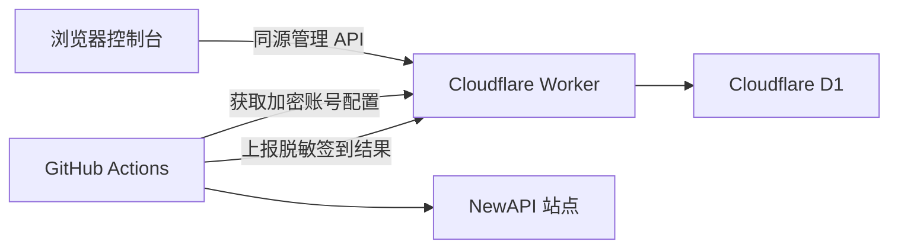

# NewAPI 自动签到

由 [zhikanyeye](https://github.com/zhikanyeye) 维护。

项目使用 Cloudflare Worker 托管账号配置、加密存储、结果 API 和可视化控制台，使用 Cloudflare D1 保存数据。GitHub Actions 只负责定时拉取账号、执行签到并上报脱敏结果。

## 功能

- 多 NewAPI 站点和多账号签到
- Worker 同源配置页面与结果看板
- D1 保存账号、运行摘要和签到历史
- Session 与 `cf_clearance` 使用 AES-256-GCM 加密存储
- 控制台访问口令与短期 Session Token
- Runner Token 隔离 GitHub Actions API
- 账号启用和停用
- 最近运行、成功率、连续失败和历史记录
- Cloudflare 拦截检测与 Playwright 回退
- 可选钉钉通知

## 架构



Worker 根地址就是控制台地址。项目不依赖 GitHub Pages，配置页面和结果页面也不需要额外域名或 CORS 设置。D1 数据库名称可以自定义，绑定变量名固定为区分大小写的 `Check`。

## 快速部署

完整步骤见 [`WORKER_DEPLOYMENT.md`](WORKER_DEPLOYMENT.md)。

推荐在 Cloudflare Dashboard 中连接 GitHub 仓库。`main` 分支更新后，Cloudflare Workers Builds 会自动部署 `worker` 目录：

| Cloudflare Build 设置 | 值 |
|-------------------------|----|
| Repository | `zhikanyeye/Newapi-checkin` |
| Production branch | `main` |
| Root directory | `worker` |
| Build command | 留空 |
| Deploy command | `npm run deploy` |

首次连接后，在 Cloudflare Worker 设置中将 D1 数据库绑定为 `Check`。仓库不保存 D1 ID，三个敏感环境变量通过 Cloudflare Runtime Secret Bindings 配置。

### 1. 创建 D1

```bash
cd worker
wrangler d1 create newapi-checkin
```

初始化数据库：

```bash
wrangler d1 execute newapi-checkin --remote --file=./schema.sql
```

### 2. 绑定 Worker 环境变量

```bash
wrangler secret put DASHBOARD_PASSWORD
wrangler secret put RUNNER_TOKEN
wrangler secret put DATA_ENCRYPTION_KEY
```

变量说明：

| 变量 | 用途 |
|------|------|
| `DASHBOARD_PASSWORD` | 控制台登录口令 |
| `RUNNER_TOKEN` | GitHub Actions 调用 Worker 的令牌 |
| `DATA_ENCRYPTION_KEY` | 账号认证信息加密主密钥 |
| `SESSION_TTL_SECONDS` | 控制台登录有效期，默认 86400 秒 |

### 3. 部署 Worker

```bash
wrangler deploy
```

部署完成后直接打开 Worker 地址，登录并添加 NewAPI 账号。

### 4. 连接 GitHub Actions

在仓库 `Settings` -> `Secrets and variables` -> `Actions` 中添加：

| GitHub Secret | 值 |
|---------------|----|
| `CHECKIN_WORKER_URL` | 部署后的 Worker 根地址 |
| `CHECKIN_RUNNER_TOKEN` | 与 Worker 的 `RUNNER_TOKEN` 完全一致 |

可选通知变量：

- `DINGTALK_WEBHOOK`
- `DINGTALK_SECRET`

进入 Actions 页面手动执行一次 `NewAPI 自动签到`，刷新 Worker 控制台即可看到结果。

## 环境变量绑定

Worker 生产环境使用 Cloudflare Secret/Variable Bindings。本地开发使用 `worker/.dev.vars`：

```bash
cd worker
cp .dev.vars.example .dev.vars
wrangler d1 execute newapi-checkin --local --file=./schema.sql
wrangler dev
```

GitHub Actions 将仓库 Secrets 映射到 Python Runner 环境变量：

```yaml
env:
  CHECKIN_WORKER_URL: ${{ secrets.CHECKIN_WORKER_URL }}
  CHECKIN_RUNNER_TOKEN: ${{ secrets.CHECKIN_RUNNER_TOKEN }}
```

`CHECKIN_RUNNER_TOKEN` 与 Cloudflare 的 `RUNNER_TOKEN` 构成同一条认证链路。

## 项目结构

```text
.
├── .github/workflows/checkin.yml  # 定时签到 Runner
├── checkin.py                     # 签到主程序
├── cf_bypass.py                   # Cloudflare 检测与浏览器回退
├── dingtalk_notifier.py           # 可选钉钉通知
├── requirements.txt               # Python 依赖
├── WORKER_DEPLOYMENT.md           # 完整部署指南
└── worker/
    ├── public/index.html          # 配置与结果控制台
    ├── src/index.js               # Worker API
    ├── package.json               # Workers Builds 项目与部署命令
    ├── schema.sql                 # D1 schema
    ├── wrangler.toml              # Worker 配置
    └── .dev.vars.example          # 本地环境变量示例
```

## API

| 方法 | 路径 | 鉴权 | 用途 |
|------|------|------|------|
| `GET` | `/api/health` | 无 | 健康检查 |
| `POST` | `/api/auth/login` | 控制台口令 | 获取短期 Token |
| `GET` | `/api/dashboard/summary` | Dashboard Token | 获取摘要和账号状态 |
| `GET` | `/api/dashboard/runs` | Dashboard Token | 获取最近运行 |
| `POST` | `/api/dashboard/accounts` | Dashboard Token | 添加加密账号 |
| `PATCH` | `/api/dashboard/accounts/:id` | Dashboard Token | 启用或停用账号 |
| `GET` | `/api/runner/config` | Runner Token | Runner 获取启用账号 |
| `POST` | `/api/runner/report` | Runner Token | Runner 上报脱敏结果 |

Dashboard API 不返回 Session、`cf_clearance`、加密密文或加密密钥。

## 本地运行 Runner

```bash
export CHECKIN_WORKER_URL=http://127.0.0.1:8787
export CHECKIN_RUNNER_TOKEN=与_Worker_RUNNER_TOKEN_一致
python3 checkin.py
```

## 安全说明

- `DATA_ENCRYPTION_KEY` 通过 SHA-256 派生 AES-256-GCM 密钥。
- 每条账号密文使用独立随机 IV。
- Dashboard Token 在 D1 中只保存 SHA-256 哈希。
- GitHub Actions 只能通过 Runner Token 获取启用账号和上报结果。
- Worker 控制台接口只返回脱敏账号信息。
- `worker/.dev.vars` 和根目录 `.env` 已加入 `.gitignore`。

## 兼容模式

`checkin.py` 仍支持 `NEWAPI_ACCOUNTS` 和 `CONFIG_URL` 作为本地回退方式。推荐部署方式以 Worker 作为唯一配置来源。

## 致谢

本项目基于 Jasonliu-0 发布的 MIT 开源项目改造。感谢原作者提供签到逻辑、配置工具和 GitHub Actions 基础实现。原始版权声明和 MIT License 保留在仓库中。

NewAPI 兼容接口来源于 [New API](https://github.com/Calcium-Ion/new-api) 项目。

## License

[MIT License](LICENSE)
