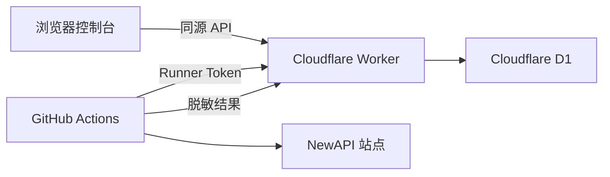

# Cloudflare Worker 完整部署指南

本文档对应当前推荐架构：Cloudflare Worker 同时托管账号配置页面、签到结果看板和 API，D1 保存加密账号与运行历史，GitHub Actions 只执行签到。

## 导航

| 阶段 | 目标 |
|------|------|
| [准备环境](#2-准备条件) | 准备 Cloudflare、GitHub 和 Wrangler |
| [创建数据库](#3-创建-d1-数据库) | 创建并初始化 D1 |
| [生成凭据](#4-配置-worker-环境变量绑定) | 生成三个独立安全值 |
| [连接仓库](#5-通过-github-仓库自动部署-worker推荐) | 开启 Workers Builds |
| [连接签到](#8-连接-github-actions) | 设置 Actions Secrets |
| [首次联调](#9-首次联调) | 验证完整数据链路 |
| [故障排查](#12-故障排查) | 按现象定位问题 |

> 控制台登录有效期和自动签到相互独立。`SESSION_TTL_SECONDS` 只影响浏览器 Dashboard Token，GitHub Actions 始终使用 `RUNNER_TOKEN`。

## 1. 架构



数据流：

1. 浏览器打开 Worker 根地址，使用 `DASHBOARD_PASSWORD` 登录。
2. 控制台将 NewAPI 账号配置提交给 Worker。
3. Worker 使用 `DATA_ENCRYPTION_KEY` 派生 AES-256-GCM 密钥，将 Session 加密后写入 D1。
4. GitHub Actions 使用 `RUNNER_TOKEN` 从 Worker 获取启用账号。
5. GitHub Actions 执行签到，将脱敏结果上报 Worker。
6. 控制台从 Worker 查询最新状态和历史结果。

## 2. 准备条件

- Cloudflare 账号
- GitHub 仓库 `https://github.com/zhikanyeye/Newapi-checkin`
- Node.js 18 或更高版本
- Python 3.11 用于本地 Runner 测试

安装 Wrangler：

```bash
npm install -g wrangler
```

登录 Cloudflare：

```bash
wrangler login
```

## 3. 创建 D1 数据库

进入 Worker 目录：

```bash
cd worker
```

创建数据库：

```bash
wrangler d1 create newapi-checkin
```

数据库名称可以自由指定。创建完成后，先初始化数据库：

```bash
wrangler d1 execute newapi-checkin --remote --file=./schema.sql
```

首次 Worker 部署完成后，在 Cloudflare Dashboard 的 Worker `Settings` -> `Bindings` 中添加 D1 Database Binding：

| 设置 | 值 |
|------|----|
| Variable name | `Check` |
| D1 database | 选择刚创建的数据库 |

`Check` 区分大小写，Worker 代码通过 `env.Check` 访问 D1。仓库无需保存数据库 ID。

## 4. 配置 Worker 环境变量绑定

Worker 需要三个敏感环境变量和一个普通变量：

| 变量 | 类型 | 用途 |
|------|------|------|
| `DASHBOARD_PASSWORD` | Secret | 登录控制台的访问口令 |
| `RUNNER_TOKEN` | Secret | GitHub Actions 调用 Runner API 的令牌 |
| `DATA_ENCRYPTION_KEY` | Secret | 加密账号 Session 的主密钥 |
| `SESSION_TTL_SECONDS` | Variable | 控制台登录有效期，默认 86400 秒 |

### 4.1 生成三个独立凭据

`DASHBOARD_PASSWORD`、`RUNNER_TOKEN` 与 `DATA_ENCRYPTION_KEY` 均由部署者自行生成。三个变量使用不同的随机值。

```bash
# 登录控制台时输入，建议保存到密码管理器
openssl rand -base64 24

# Worker 和 GitHub Actions 之间的长期认证令牌
openssl rand -hex 32

# 加密 D1 中账号认证信息的主密钥
openssl rand -hex 32
```

变量生命周期：

| 变量 | 有效期 | 轮换影响 |
|------|--------|----------|
| `DASHBOARD_PASSWORD` | 手动更换前有效 | 更换后使用新口令登录 |
| `RUNNER_TOKEN` | 手动更换前有效 | Worker 与 GitHub 必须同步更新 |
| `DATA_ENCRYPTION_KEY` | 长期保留 | 更换后已有账号密文无法解密，需要重新录入 |
| `SESSION_TTL_SECONDS` | 每次登录时应用 | 只影响浏览器登录，不影响 Actions |

推荐将 `DATA_ENCRYPTION_KEY` 安全备份。丢失该值后，D1 中保存的账号密文无法恢复。

### 4.2 方式 A：Wrangler 环境绑定

在 `worker` 目录执行：

```bash
wrangler secret put DASHBOARD_PASSWORD
wrangler secret put RUNNER_TOKEN
wrangler secret put DATA_ENCRYPTION_KEY
```

每条命令会提示输入值。使用独立的长随机值，`RUNNER_TOKEN` 和 `DATA_ENCRYPTION_KEY` 建议至少 32 字节。

`SESSION_TTL_SECONDS` 已在 `wrangler.toml` 的 `[vars]` 中绑定：

```toml
[vars]
SESSION_TTL_SECONDS = "86400"
```

### 4.3 方式 B：Cloudflare 控制台环境绑定

1. 打开 Cloudflare Dashboard。
2. 进入 `Workers & Pages`。
3. 选择 `newapi-checkin` Worker。首次部署后才会出现该 Worker。
4. 打开 `Settings` -> `Variables and Secrets`。
5. 分别添加 `DASHBOARD_PASSWORD`、`RUNNER_TOKEN`、`DATA_ENCRYPTION_KEY`。
6. 三个敏感变量选择 `Secret` 类型。
7. 添加普通变量 `SESSION_TTL_SECONDS=86400`。
8. 保存并重新部署 Worker。

### 4.4 本地开发绑定

复制示例文件：

```bash
cp .dev.vars.example .dev.vars
```

填写本地测试值。`worker/.dev.vars` 已加入 `.gitignore`，真实值不会进入仓库。

## 5. 通过 GitHub 仓库自动部署 Worker（推荐）

Cloudflare Workers Builds 可以直接连接本仓库。连接完成后，每次推送到 `main` 分支都会自动部署 Worker，GitHub 仓库无需保存 Cloudflare API Token。

### 5.1 首次部署前准备

Git 集成会读取仓库中的 `worker/wrangler.toml`。请先完成以下准备：

1. 在 Cloudflare 创建 `newapi-checkin` D1 数据库。
2. 初始化数据库 schema。
3. 将代码推送到 GitHub 的 `main` 分支。
4. 确认 `worker/package.json` 已存在。

### 5.2 在 Cloudflare 连接 GitHub

1. 打开 Cloudflare Dashboard。
2. 进入 `Workers & Pages`。
3. 选择 `Create application`。
4. 选择 `Import a repository` 或 `Connect to Git`。
5. 授权 Cloudflare GitHub App 访问 `zhikanyeye/Newapi-checkin`。
6. 选择仓库 `zhikanyeye/Newapi-checkin`。
7. 填写构建设置：

| 设置 | 值 |
|------|----|
| Project name | `newapi-checkin` |
| Production branch | `main` |
| Root directory | `worker` |
| Build command | 留空 |
| Deploy command | `npm run deploy` |

`worker/package.json` 中已经声明部署命令：

```json
{
  "scripts": {
    "deploy": "wrangler deploy"
  }
}
```

Cloudflare 会在 `worker` 目录安装依赖，并执行 `npm run deploy`。`wrangler.toml` 会自动加载 Worker 入口和 Static Assets。

### 5.3 首次构建

点击 `Save and Deploy`。构建日志应包含以下阶段：

```text
Installing dependencies
Running deploy command: npm run deploy
Uploading static assets
Deploying newapi-checkin
```

构建完成后，Cloudflare 会生成 Worker 地址：

```text
https://newapi-checkin.<你的-workers-subdomain>.workers.dev
```

### 5.4 配置运行时环境变量

首次构建完成后，进入 Worker 的 `Settings` -> `Variables and Secrets`，添加：

- Secret `DASHBOARD_PASSWORD`
- Secret `RUNNER_TOKEN`
- Secret `DATA_ENCRYPTION_KEY`
- Variable `SESSION_TTL_SECONDS=86400`

保存后，在 `Deployments` 页面重新部署最新版本，或者向 `main` 分支推送一次提交。

然后进入 `Settings` -> `Bindings`，将目标 D1 数据库绑定为 `Check`。

这些变量属于 Worker Runtime Bindings。Cloudflare 构建过程无需读取三个敏感值，GitHub 仓库也无需保存这些值。

### 5.5 自动部署行为

- 推送到 `main`：Cloudflare 自动构建并部署生产 Worker。
- Pull Request 或其他分支：可在 Workers Builds 设置中开启非生产分支构建。
- 构建失败：Cloudflare 保留上一份成功部署的 Worker。
- D1 数据：代码重新部署不会清除已有账号和签到历史。

### 5.6 验证 Git 部署

访问健康检查：

```bash
curl https://newapi-checkin.<你的-workers-subdomain>.workers.dev/api/health
```

预期响应：

```json
{"ok":true,"service":"newapi-checkin-worker","database":"connected","time":"..."}
```

若 Binding 或 Secret 尚未配置完整，接口返回 HTTP 503，并在 `missing` 数组中列出缺失项：

```json
{"ok":false,"service":"newapi-checkin-worker","missing":["Check","RUNNER_TOKEN"],"time":"..."}
```

浏览器打开 Worker 根地址，应显示签到控制台。

## 6. 使用 Wrangler 手工部署（备用）

在 `worker` 目录执行：

```bash
wrangler deploy
```

部署完成后会得到类似地址：

```text
https://newapi-checkin.<你的-workers-subdomain>.workers.dev
```

健康检查：

```bash
curl https://newapi-checkin.<你的-workers-subdomain>.workers.dev/api/health
```

预期响应：

```json
{"ok":true,"service":"newapi-checkin-worker","database":"connected","time":"..."}
```

浏览器直接打开 Worker 根地址。配置页面、结果看板和 API 均由同一个 Worker 域名提供，无需 GitHub Pages，也无需配置 CORS。

## 7. 添加签到账号

1. 打开 Worker 根地址。
2. 使用 `DASHBOARD_PASSWORD` 登录。
3. 填写账号名称、NewAPI 站点 URL 和 Session Cookie。
4. 根据站点要求填写 `user_id` 或 `cf_clearance`。
5. 点击“添加账号”。
6. 页面显示账号后，可随时启用或停用。

前端只能读取账号名称、站点 Origin、启用状态和签到结果。Worker API 不会向前端返回 Session、`cf_clearance` 或加密密文。

## 8. 连接 GitHub Actions

GitHub Actions 只需要两个必填 Secrets：

| GitHub Secret | 值 |
|---------------|----|
| `CHECKIN_WORKER_URL` | Worker 根地址，不带末尾 `/` |
| `CHECKIN_RUNNER_TOKEN` | 与 Worker 的 `RUNNER_TOKEN` 完全一致 |

配置步骤：

1. 打开 GitHub 仓库。
2. 进入 `Settings` -> `Secrets and variables` -> `Actions`。
3. 打开 `Secrets` 标签。
4. 添加 `CHECKIN_WORKER_URL`。
5. 添加 `CHECKIN_RUNNER_TOKEN`。
6. 可选添加 `DINGTALK_WEBHOOK` 和 `DINGTALK_SECRET`。

工作流会将 GitHub Secrets 映射为 Runner 环境变量：

```yaml
env:
  CHECKIN_WORKER_URL: ${{ secrets.CHECKIN_WORKER_URL }}
  CHECKIN_RUNNER_TOKEN: ${{ secrets.CHECKIN_RUNNER_TOKEN }}
```

两个系统的绑定关系：

```text
Cloudflare RUNNER_TOKEN
        =
GitHub CHECKIN_RUNNER_TOKEN
```

`CHECKIN_WORKER_URL` 指向部署后的 Worker，形成完整连接。

## 9. 首次联调

在 GitHub 仓库中进入 `Actions` -> `NewAPI 自动签到` -> `Run workflow`。

工作流日志应依次出现：

```text
[Worker] 正在获取启用账号配置...
[Worker] 成功获取 N 个账号配置
签到完成: 成功 N, 失败 N
[Worker] 签到结果上报成功
```

执行结束后刷新 Worker 控制台，应看到：

- 最近运行时间
- 成功和失败账号数
- 成功率
- 每个账号最近状态
- 最近 30 次运行记录

## 10. 本地联调

初始化本地 D1：

```bash
wrangler d1 execute newapi-checkin --local --file=./schema.sql
```

启动 Worker：

```bash
wrangler dev
```

Runner 使用本地 Worker：

```bash
export CHECKIN_WORKER_URL=http://127.0.0.1:8787
export CHECKIN_RUNNER_TOKEN=与_dev_vars_中_RUNNER_TOKEN_一致
python3 ../checkin.py
```

## 11. 更新部署

GitHub 自动部署模式下，将代码推送到 `main` 分支即可。手工部署模式执行：

```bash
cd worker
wrangler deploy
```

`DATA_ENCRYPTION_KEY` 用于解密已有账号配置。保留该值可持续读取历史账号密文。密钥轮换需要先重新录入所有账号。

## 12. 故障排查

### 控制台提示访问口令错误

检查 Worker 的 `DASHBOARD_PASSWORD` 环境绑定，更新后重新部署。

### Actions 日志显示 Runner 未授权

检查 Cloudflare `RUNNER_TOKEN` 与 GitHub `CHECKIN_RUNNER_TOKEN` 是否完全一致。

### Actions 无法获取账号

检查以下项目：

- `CHECKIN_WORKER_URL` 使用 Worker 根地址
- Worker `/api/health` 可访问
- 控制台中至少有一个启用账号
- D1 schema 已在远程数据库执行

### Worker 返回解密错误

当前 `DATA_ENCRYPTION_KEY` 与保存账号时使用的值不一致。恢复原密钥，或使用新密钥重新录入账号。

### 页面打开后显示静态资源绑定未配置

确认 `wrangler.toml` 包含：

```toml
[assets]
directory = "./public"
binding = "ASSETS"
```

然后重新执行 `wrangler deploy`。

### Cloudflare Git 构建找不到 wrangler.toml

检查 Workers Builds 的 `Root directory` 是否为 `worker`。构建命令执行目录必须包含 `package.json` 和 `wrangler.toml`。

### Worker 提示 Check 未定义

进入 Worker 的 `Settings` -> `Bindings`，添加 D1 Database Binding，并将 Variable name 设置为区分大小写的 `Check`。

### GitHub 推送后没有触发 Worker 部署

检查以下设置：

- Cloudflare GitHub App 是否仍有仓库访问权限
- Workers Builds 的 Production branch 是否为 `main`
- Worker 的 Builds 设置是否启用自动部署
- GitHub 提交是否已进入 `main` 分支

## 13. 安全建议

- 为三个敏感变量使用不同的长随机值。
- 将 GitHub 仓库设为私有可进一步减少工作流信息暴露。
- 定期轮换 `DASHBOARD_PASSWORD` 和 `RUNNER_TOKEN`。
- 将 Worker 自定义域名接入 Cloudflare Access 可增加身份验证层。
- 日志和截图中避免展示 Session、Runner Token 和加密密钥。
