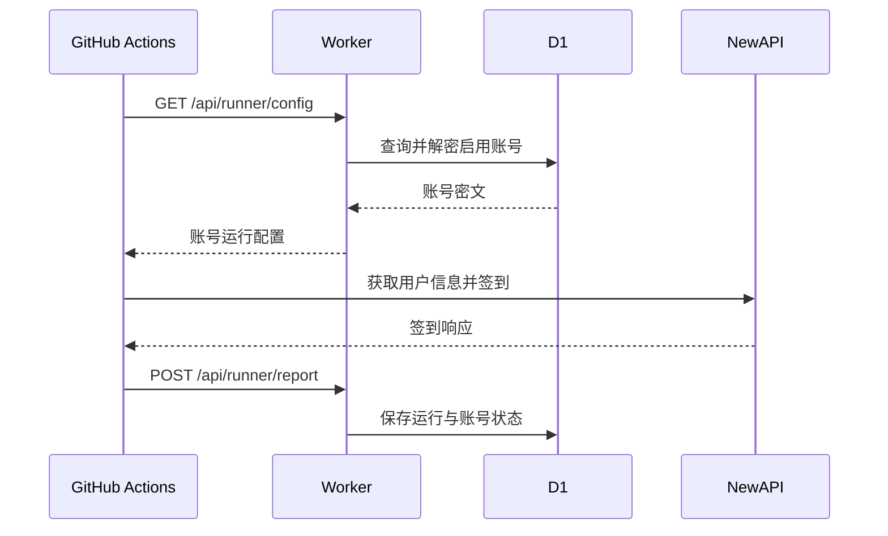

# 系统架构

## 概览

Check Console 采用 Worker-only Web 架构。Cloudflare Worker 同时提供 Dashboard 静态资源和 API，Cloudflare D1 保存账号与运行数据，GitHub Actions 负责定时执行 Python Runner。

```mermaid
    U["用户浏览器"] -->|"Dashboard Token"| W["Cloudflare Worker"]
    W -->|"Check Binding"| D["Cloudflare D1"]
    G["GitHub Actions Runner"] -->|"Runner Token"| W
    G -->|"Session 与用户 ID"| N["NewAPI 站点"]
    G -->|"脱敏运行结果"| W
```

## 组件职责

### Cloudflare Worker

`worker/src/index.js` 负责：

- 托管 `worker/public/index.html`。
- 提供健康检查、登录、Dashboard 和 Runner API。
- 创建并维护 D1 表结构。
- 加密和解密账号运行配置。
- 校验 Dashboard Token 与 Runner Token。
- 保存运行摘要并更新账号健康状态。

### Dashboard

`worker/public/index.html` 是内嵌 CSS 和 JavaScript 的单文件界面，负责：

- 使用访问口令登录。
- 展示首次使用进度、运行摘要和最近历史。
- 添加账号、更新凭据、启用或停用账号。
- 在浏览器 `localStorage` 保存短期 Dashboard Token。

### Runner

`checkin.py` 负责：

- 按优先级加载 Worker、远程配置或环境变量账号。
- 获取 NewAPI 用户信息。
- 执行签到并兼容常见响应格式。
- 查询本月签到统计。
- 上报脱敏结果。
- 调用可选钉钉通知模块。

### Cloudflare 回退

`cf_bypass.py` 在普通 HTTP 请求遇到 Cloudflare 挑战时提供 Playwright 浏览器回退。该流程受目标站点策略、浏览器环境和网络条件影响。

## 运行时数据流



## 认证模型

| 访问方 | 凭据 | 校验方式 | 权限 |
|--------|------|----------|------|
| 浏览器登录 | `DASHBOARD_PASSWORD` | 与 Worker Secret 比较 | 签发 Dashboard Token |
| Dashboard | Dashboard Token | D1 中 SHA-256 哈希与过期时间 | 管理账号、查看结果 |
| GitHub Actions | `RUNNER_TOKEN` | 与 Worker Secret 比较 | 获取启用账号、上报结果 |

## 数据模型

### accounts

保存账号名称、站点 Origin、加密运行配置、启用状态、连续失败次数和最近结果。

### runs

保存一次 Runner 执行的时间、账号总数、成功数和失败数。

### run_results

保存一次运行中的账号级结果，包括消息、奖励额度、当月签到次数和 Session 失效标记。

### sessions

保存 Dashboard Token 哈希、创建时间和过期时间。

## D1 生命周期

`worker/wrangler.toml` 仅声明 `Check` Binding。Wrangler 部署时按远端 D1 Binding 类型与名称继承已有数据库；远端缺少 `Check` 时自动配置新资源。Worker 每个实例首次处理请求时执行幂等建表语句。

## 关键约束

1. D1 Binding 变量名固定为 `Check`。
2. Dashboard API 响应不包含账号密文或明文凭据。
3. Runner API 是唯一返回解密账号配置的接口。
4. `DATA_ENCRYPTION_KEY` 必须持续可用才能解密已有账号。
5. 运行上报失败不改变已完成签到的实际结果。
